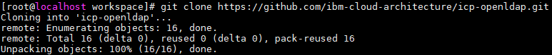
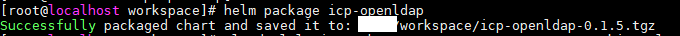
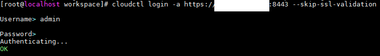
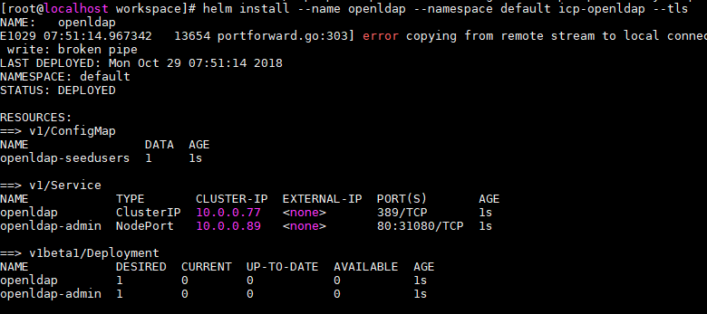
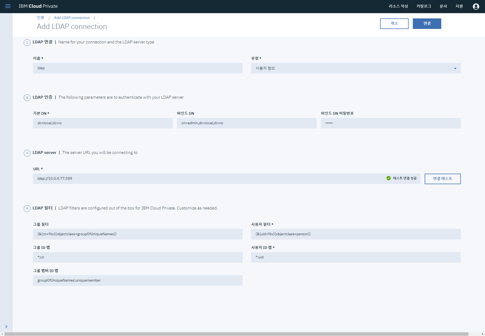

# ICP - OpenLDAP 연결

OpenLDAP을 연결하는 종류는 여러가지가 존재한다.  
Native로 설치하는 방법도 있고, Docker 혹은 Helm Charts로 설치하는 방법이 있다.  

Docker와 Helm Charts로 확인은 했지만 Native로는 확인하지 못했지만, 다를 건 없을 것 같다.  

Docker로 설치하는 방법은 아래 URL을 참조하여 설치하면 된다.  
[https://github.com/osixia/docker-openldap](https://github.com/osixia/docker-openldap)  

Helm charts로 설치하고 설정하는편이 간단하기 때문에 우리는 아래 URL을 참고하여 생성한다.  
[https://github.com/ibm-cloud-architecture/icp-openldap](https://github.com/ibm-cloud-architecture/icp-openldap)  

먼저 Git Clone을 한다.  
``` bash
git clone https://github.com/ibm-cloud-architecture/icp-openldap
```
  

Git Clone 이후에 helm package 명령을 통해 package를 만든다. (**주의**, 기본 Chart.yaml은 openldap으로 되어 있어 repository명과 동일하게 맞춰줘야 한다. icp-openldap으로 변경한다.)  
``` bash
helm packge icp-openldap
```


cloudctl로 클러스터에 로그인 한다.
``` bash
cloudctl login -a https://<master-ip>:8443 --skip-ssl-validation
```


helm install을 시도한다.
``` bash
helm install --name openldap --namespace default icp-openldap --tls
```



설치 이후 설정은 icp와의 설정은 [https://github.com/ibm-cloud-architecture/icp-openldap](https://github.com/ibm-cloud-architecture/icp-openldap)에서 Readme파일을 참고하여 설정한다.  

